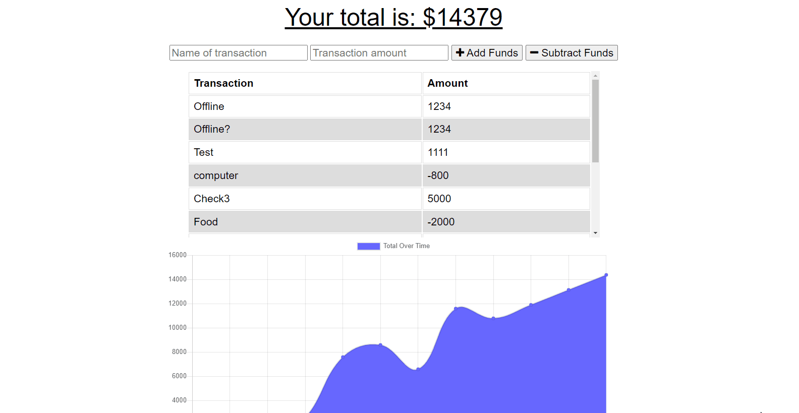

# Progressive Web App - Budget Tracker

User is able to log into budget tracker app to keep track of budgets. When throttled to offline (or when user actually goes offline) app continues to allow user to keep track of budget. Once back online, stored variables will be appended to seemlessly to track all budgeting done.
## Demo

## Lessons Learned

Fun to test out and make sure that app is fully functional while it is offline. 